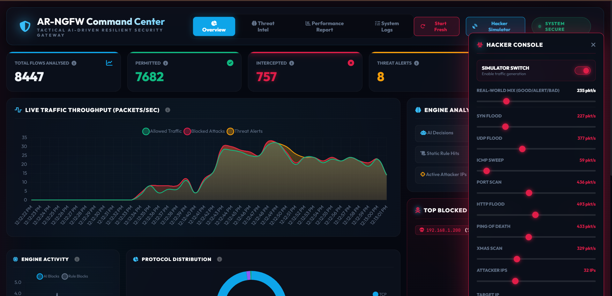
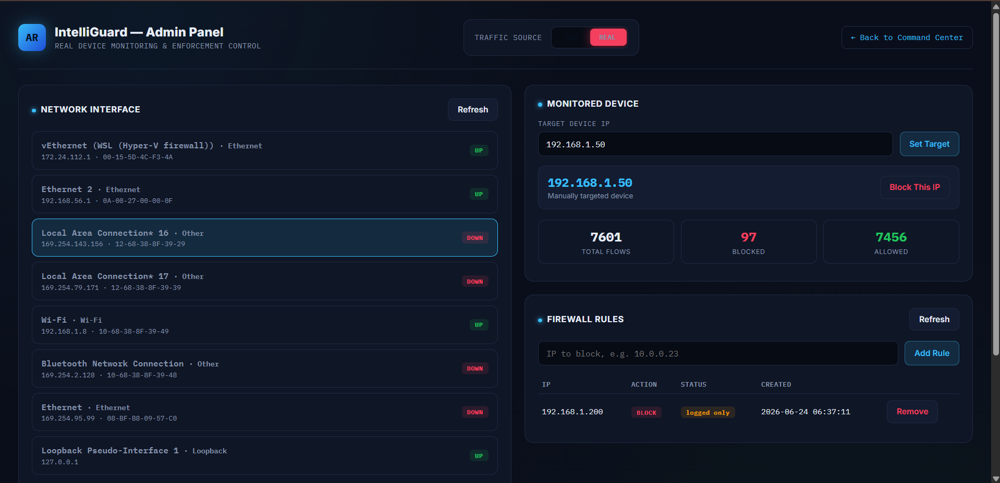
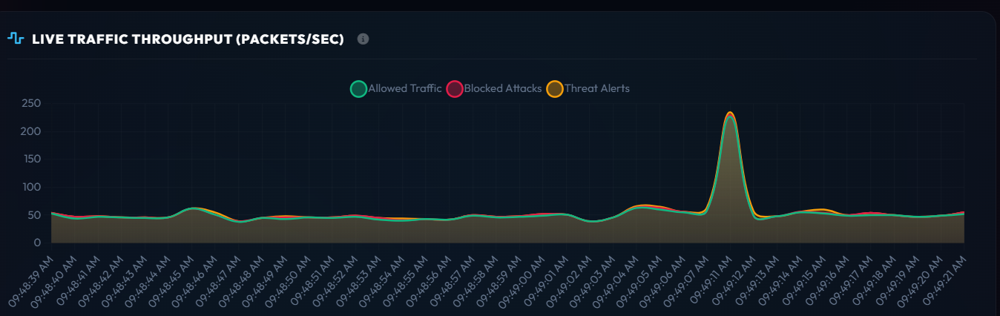
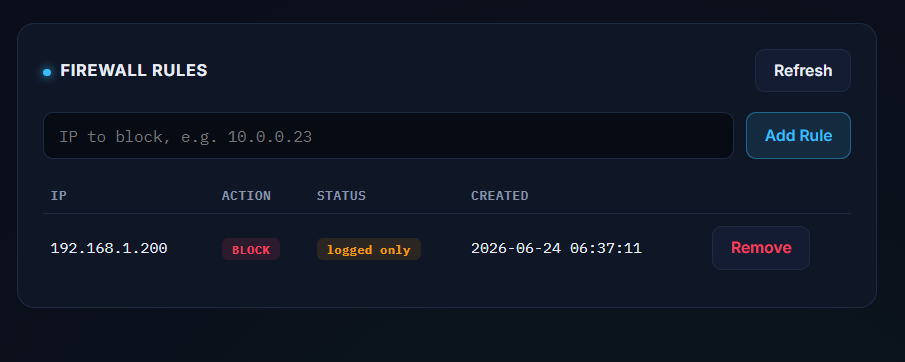

# 🛡️ IntelliGuard NGFW

> **AI-Powered Next Generation Firewall for Real-Time Network Threat Detection and Monitoring**

IntelliGuard NGFW is an AI-driven Next Generation Firewall developed during the **DRDO Internship Program** by a team of Computer Science students from **Sharda University, Agra**. The project combines traditional firewall policies with machine learning to monitor network traffic, detect malicious activity, and visualize security events through an interactive dashboard.

---

## Features

* Real-time packet capture and traffic monitoring
* Flow-based feature extraction pipeline
* Machine Learning-based threat detection
* Static and dynamic firewall rule management
* Live security dashboard with analytics
* Attack simulation environment
* Device monitoring and IP-based targeting
* Audit logging and threat visualization

---

## System Architecture

```text
Network Layer
      │
      ▼
Feature Pipeline
      │
      ▼
AI Engine
      │
      ▼
Firewall Engine
      │
      ▼
Dashboard
```

For the detailed architecture, see **`docs/architecture.md`**.

---

## Project Structure

```text
intelli-guard-NGFW/
│
├── ai_engine/
├── dashboard/
├── feature_pipeline/
├── firewall_engine/
├── network_layer/
├── data/
├── docs/
├── config.yaml
├── main.py
└── requirements.txt
```

---

## Technology Stack

* Python
* Flask
* Scapy
* Scikit-Learn
* Pandas
* NumPy
* HTML
* CSS
* JavaScript

---

## Getting Started

### Clone the Repository

```bash
git clone https://github.com/mohitUpraity/intelli-guard-NGFW.git
cd intelli-guard-NGFW
```

### Install Dependencies

```bash
pip install -r requirements.txt
```

### Configure

Update the required network interface and configuration values in:

```text
config.yaml
```

---

## Running the Project

### Start the Firewall Engine

```bash
python main.py
```

### Start the Dashboard

```bash
python dashboard/app.py
```

Open your browser at:

```text
http://127.0.0.1:5001
```

---

# Dashboard

## Main Monitoring Dashboard

The main dashboard provides real-time visibility into network traffic, firewall activity, and security events.



---

## Admin Panel

The admin panel allows administrators to configure the monitored device, switch between real and simulation modes, and manage attack simulations.



---

## Live Traffic Monitoring

The dashboard visualizes network activity and threat trends in real time, helping administrators monitor ongoing traffic and detect suspicious behavior.



---

## Firewall Rules

Administrators can create, manage, and monitor firewall rules directly from the dashboard. Rules are persisted and immediately reflected by the firewall engine.



---


---

## Team

| Member        | Responsibility                        |
| ------------- | ------------------------------------- |
| Mohit         | Network Layer                         |
| Ilma Rehman   | Feature Pipeline & System Integration |
| Kunal Diwakar | AI Engine                             |
| Megha Singh   | Firewall Engine                       |
| Priya Parihar | Dashboard & Visualization             |

---

## Documentation

Additional documentation is available in the **docs/** directory.

* System Architecture
* Git Workflow
* Internship Report
* Defense Guide

---

## Version

**Current Release:** v1.0

---

## License

This project was developed as part of the DRDO Internship Program for academic and research purposes.
